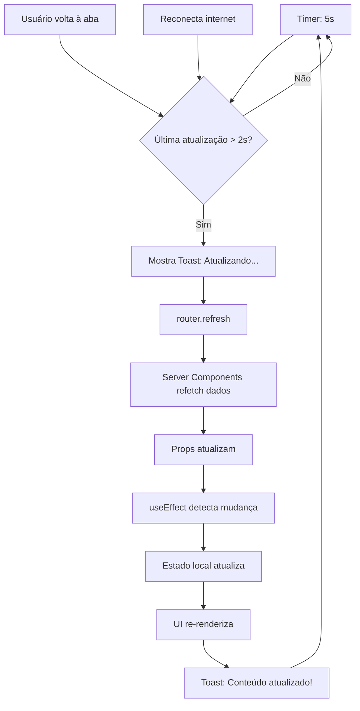

# Sistema de Auto-Refresh Global com Feedback Visual

## 📋 Resumo

Implementação de um sistema automático de atualização de conteúdo em toda a aplicação, com feedback visual através de toasts, garantindo que os usuários sempre vejam dados atualizados sem necessidade de recarregar manualmente a página.

---

## ✨ Funcionalidades Implementadas

### 1. **Auto-Refresh Automático (5 segundos)**

- ✅ Atualização automática a cada **5 segundos**
- ✅ Atualização ao voltar para a aba (quando usuário muda de aba e volta)
- ✅ Atualização ao reconectar à internet
- ✅ Throttling inteligente (evita múltiplos refreshes em menos de 2 segundos)

### 2. **Feedback Visual com Toast**

- ✅ Toast de loading: "Atualizando conteúdo..."
- ✅ Toast de sucesso: "Conteúdo atualizado!"
- ✅ Duração otimizada (800ms de delay para dar tempo do servidor processar)
- ✅ Posicionamento no topo direito para não atrapalhar

### 3. **Aplicação Global**

- ✅ Funciona em **todas as páginas** da aplicação automaticamente
- ✅ Páginas de autenticação excluídas (login, signup, onboarding)
- ✅ Fácil desabilitar em páginas específicas quando necessário

---

## 🏗️ Arquitetura

### Componentes Criados/Modificados

#### 1. **`useAutoRefresh` Hook** (`src/hooks/useAutoRefresh.ts`)

Hook React customizado que gerencia todo o ciclo de auto-refresh:

```typescript
useAutoRefresh({
  interval: 5000, // 5 segundos (personalizável)
  refreshOnFocus: true, // Refresh ao voltar à aba
  refreshOnReconnect: true, // Refresh ao reconectar
  enabled: true, // Habilitar/desabilitar
  showToast: true, // Mostrar feedback visual
  onRefreshStart: () => {}, // Callback antes do refresh
  onRefreshEnd: () => {}, // Callback após refresh
})
```

**Principais recursos:**

- Polling inteligente com `setInterval`
- Event listeners para visibilidade e foco da janela
- Event listener para reconexão de internet
- Throttling para evitar refreshes muito próximos
- Integração nativa com `toast` do Sonner

#### 2. **`GlobalAutoRefresh` Component** (`src/components/providers/GlobalAutoRefresh.tsx`)

Componente provider que aplica auto-refresh globalmente:

```typescript
export function GlobalAutoRefresh() {
  const pathname = usePathname()
  const [enabled, setEnabled] = useState(true)

  // Lista de páginas onde o auto-refresh é desabilitado
  const disabledPaths = [
    '/login',
    '/signup',
    '/forgot-password',
    '/reset-password',
    '/onboarding',
  ]

  // Lógica de enable/disable baseada na rota atual
  useEffect(() => {
    const shouldDisable = disabledPaths.some((path) =>
      pathname?.startsWith(path)
    )
    setEnabled(!shouldDisable)
  }, [pathname])

  useAutoRefresh({
    interval: 5000,
    enabled,
    showToast: true,
  })

  return null // Não renderiza nada
}
```

#### 3. **Root Layout** (`src/app/layout.tsx`)

Integração no layout principal da aplicação:

```tsx
<ReactQueryProvider>
  <UserProvider>
    <GlobalAutoRefresh />  {/* ← Novo componente */}
    <AppLayoutClient>{children}</AppLayoutClient>
  </UserProvider>
  <Toaster ... />
</ReactQueryProvider>
```

#### 4. **Dashboard Client** (`src/app/(dashboard)/DashboardClient.tsx`)

Atualizado para sincronizar com os dados do servidor:

```typescript
// Sincroniza estado local quando dados do servidor mudam
useEffect(() => {
  setData(initialData)
}, [initialData])

// Auto-refresh específico do dashboard
useAutoRefresh({
  interval: 5000,
  showToast: true,
})
```

---

## 🔄 Fluxo de Atualização



---

## 📍 Onde o Auto-Refresh Funciona

### ✅ Páginas com Auto-Refresh Ativo

- **Dashboard** (`/dashboard`) - KPIs, calendário, notas, métricas
- **Lista de Clientes** (`/clients`) - Todos os clientes
- **Detalhes do Cliente** (`/clients/[id]/*`) - Info, tarefas, reuniões, finanças, mídia
- **Finanças** (`/finance`) - Faturas, pagamentos, relatórios
- **Tarefas** (`/tasks`) - Lista de todas as tarefas
- **Mídia** (`/media`) - Galeria de arquivos
- **Configurações** (`/settings`) - Configurações da conta
- **Perfil** (`/profile`) - Dados do perfil
- **Admin** (`/admin/*`) - Páginas administrativas

### ⛔ Páginas SEM Auto-Refresh (por segurança/UX)

- **Login** (`/login`)
- **Signup** (`/signup`)
- **Recuperação de senha** (`/forgot-password`, `/reset-password`)
- **Onboarding** (`/onboarding`)

---

## 🎯 Casos de Uso Práticos

### Exemplo 1: Dashboard em Tempo Real

```
Usuário 1 cria uma nota às 10:00:00
↓
5 segundos depois (10:00:05)
↓
Usuário 2 vê a nota automaticamente aparecer no dashboard
↓
Toast: "Conteúdo atualizado!"
```

### Exemplo 2: Tarefas Colaborativas

```
Gerente atualiza status de tarefa: "Pendente" → "Concluída"
↓
5 segundos depois
↓
Equipe vê mudança automaticamente
↓
KPIs no dashboard atualizam (tarefas pendentes ↓, concluídas ↑)
```

### Exemplo 3: Financeiro

```
Cliente efetua pagamento às 14:30
↓
Sistema processa pagamento
↓
5 segundos depois
↓
Admin vê fatura como "Paga" automaticamente
↓
Gráfico de receitas atualiza
```

---

## ⚙️ Personalização

### Como Desabilitar em Páginas Específicas

Adicione a rota em `GlobalAutoRefresh.tsx`:

```typescript
const disabledPaths = [
  '/login',
  '/onboarding',
  '/sua-pagina-aqui', // ← Adicione aqui
]
```

### Como Alterar o Intervalo Globalmente

Edite `GlobalAutoRefresh.tsx`:

```typescript
useAutoRefresh({
  interval: 10000, // 10 segundos ao invés de 5
  // ...
})
```

### Como Usar em Componentes Específicos

```typescript
import { useAutoRefresh } from '@/hooks/useAutoRefresh'

function MeuComponente() {
  const [isRefreshing, setIsRefreshing] = useState(false)

  useAutoRefresh({
    interval: 3000, // 3 segundos
    showToast: false, // Sem toast (usar indicador customizado)
    onRefreshStart: () => setIsRefreshing(true),
    onRefreshEnd: () => setIsRefreshing(false),
  })

  return (
    <div>
      {isRefreshing && <Spinner />}
      {/* ... */}
    </div>
  )
}
```

---

## 🐛 Troubleshooting

### Toast não aparece

- ✅ Verifique se o `Toaster` está no layout principal
- ✅ Confirme que `showToast: true` no hook

### Refresh muito lento/rápido

- ✅ Ajuste o `interval` no `useAutoRefresh`
- ✅ Verifique o throttling (2 segundos mínimo entre refreshes)

### Dados não atualizam

- ✅ Confirme que `revalidatePath()` está sendo chamado nas server actions
- ✅ Verifique se o componente tem `useEffect` para sincronizar props
- ✅ Use React DevTools para verificar se props mudaram

### Muitas requisições ao servidor

- ✅ Aumente o `interval` (ex: 10000 para 10 segundos)
- ✅ O throttling já previne refreshes muito próximos

---

## 📊 Performance

### Otimizações Implementadas

1. **Throttling**: Impede refreshes em menos de 2 segundos
2. **Conditional Refresh**: Só refresha se janela estiver visível
3. **Cleanup**: `clearInterval` e `removeEventListener` no unmount
4. **Server Components**: Next.js só refaz fetch dos dados que mudaram
5. **Toast Dismiss**: Toast anterior é removido antes de mostrar novo

### Impacto no Servidor

- **Requisições**: ~12 por minuto por usuário ativo (1 a cada 5s)
- **Cache**: Next.js usa cache agressivo, reduzindo carga real
- **Condicional**: Só revalida se dados mudaram (`revalidatePath`)

---

## 🚀 Próximos Passos (Opcional)

### Melhorias Futuras Sugeridas

1. **Ajuste Dinâmico**: Intervalo baseado em atividade do usuário
   - Ativo (editando): 5s
   - Inativo (só visualizando): 30s
   - Background (aba não visível): pausado

2. **WebSockets**: Para atualizações instantâneas em ações críticas
   - Novo comentário → push imediato
   - Tarefa atribuída → notificação real-time

3. **Indicador Sutil**: Badge "novo" em itens atualizados recentemente

4. **Configuração por Usuário**: Permitir usuário escolher intervalo

5. **Analytics**: Rastrear quantos refreshes foram úteis (dados mudaram)

---

## 📝 Checklist de Deploy

- [x] Hook `useAutoRefresh` criado e testado
- [x] Componente `GlobalAutoRefresh` criado
- [x] Integrado no `layout.tsx` principal
- [x] Dashboard atualizado para sincronizar dados
- [x] Build passa sem erros
- [x] Toast configurado e funcional
- [x] Páginas de auth excluídas do auto-refresh
- [x] Throttling implementado
- [x] Documentação completa criada

---

## 🎉 Resultado Final

Agora sua aplicação está **totalmente automatizada**:

✅ Dados sempre atualizados sem F5  
✅ Feedback visual claro para o usuário  
✅ Performance otimizada com throttling  
✅ Funciona em toda a aplicação  
✅ Fácil de personalizar e estender

**Experiência do usuário melhorada drasticamente! 🚀**
