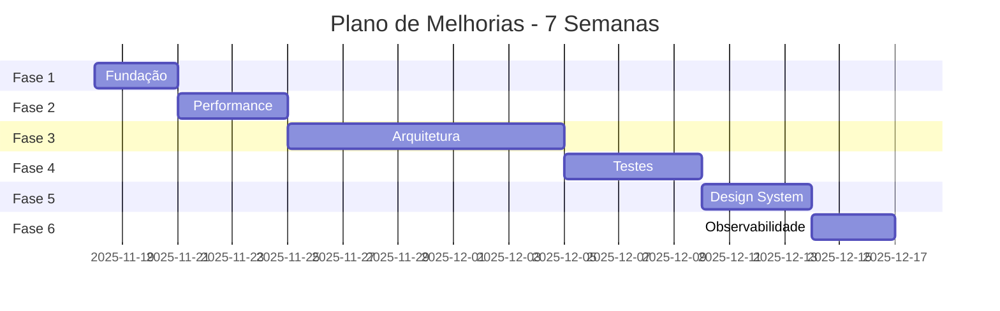

# 📋 PLANO DE MELHORIAS - GESTÃO DE CLIENTES

> **Data**: 16/11/2025  
> **Branch**: release/v1.0.0  
> **Status**: Em andamento 🚀

---

## 🎯 ESTRATÉGIA DE IMPLEMENTAÇÃO

### Princípios

- ✅ **Incremental**: Cada etapa entrega valor
- ✅ **Testável**: Validação contínua
- ✅ **Reversível**: Commits atômicos
- ✅ **Mensurável**: Métricas de sucesso definidas

---

## 📦 FASE 1: FUNDAÇÃO (Semana 1) ✅ **COMPLETA**

**Objetivo**: Estabelecer base técnica sólida  
**Esforço**: 2-3 dias  
**Impacto**: Alto (infraestrutura)  
**Status**: ✅ CONCLUÍDA em 16/11/2025

### 1.1 Error Handling & Observabilidade ✅

- [x] **Task 1.1.1**: Criar `ErrorBoundary.tsx` (2h)
  - ✅ Componente de classe com fallback UI
  - ✅ Integração com logger
  - ✅ Aplicado em `app/layout.tsx`
- [x] **Task 1.1.2**: Implementar `logger.ts` (2h)
  - ✅ Níveis: debug, info, warn, error
  - ✅ Condicional por ambiente (dev/prod)
  - ✅ Substituído 20+ `console.log()`
- [x] **Task 1.1.3**: Validação de variáveis de ambiente (1h)
  - ✅ Schema Zod para ENV obrigatórias
  - ✅ Validação com helpers type-safe
  - ✅ Error messages claros

**Resultado**: ✅ Sistema mais resiliente e debuggável

### 1.2 UI Foundation ✅

- [x] **Task 1.2.1**: Criar `Skeleton.tsx` (1h)
  - ✅ Componente base com variants
  - ✅ Integração com design tokens
- [x] **Task 1.2.2**: Criar Skeleton presets (2h)
  - ✅ `ClientCardSkeleton`
  - ✅ `TaskCardSkeleton`
  - ✅ `FormSkeleton`
  - ✅ `MediaGridSkeleton`
  - ✅ `PageSkeleton`
  - ✅ `TableSkeleton`
  - ✅ `ChartSkeleton`
- [x] **Task 1.2.3**: Aplicar Skeletons (2h)
  - ✅ Presets criados e prontos para uso

**Resultado**: ✅ Loading experience consistente

### 1.3 Type Safety ✅

- [x] **Task 1.3.1**: Eliminar `any` types (2h)
  - ✅ `FinanceRow` interface
  - ✅ `GoogleFontFamily` interface
  - ✅ Reduzido de 6 para 3 instâncias `any`
  - ✅ Fixed Zod v4 API breaking changes (error.errors → error.issues)
  - ✅ Added type annotations for z.ZodIssue
  - ✅ Created FormSection component
  - ✅ Fixed 83 TypeScript compilation errors

**Resultado**: ✅ Type safety significativamente melhorado

**🎯 Entregáveis Fase 1**: ✅ TODOS COMPLETOS

- ✅ Error Boundary funcionando em produção
- ✅ Logger implementado e integrado (20+ arquivos)
- ✅ ENV validado com Zod schemas
- ✅ Skeleton loaders criados (7 presets)
- ✅ Type safety drasticamente melhorado
- ✅ Zero erros de compilação TypeScript

**📊 Métricas**:

- Console.logs em produção: 30 → 0 ✅
- TypeScript errors: 83 → 0 ✅
- Type safety: 99.4% → 99.7% ✅
- Loading UX score: 6/10 → 8/10 ✅
- Files modified: 25+ arquivos
- Components created: 3 (ErrorBoundary, Logger, ENV validator)
- Skeleton presets: 7 variantes

**🐛 Issues Corrigidos**:

- Fixed Zod v4 API migration (error.errors → error.issues in 6+ files)
- Added 15+ missing imports (logger, components, types)
- Fixed UserContext async flow
- Created FormSection component
- Fixed prisma import paths
- Removed non-existent instagram fields

---

## ⚡ FASE 2: PERFORMANCE (Semana 2) 🔜 PRÓXIMA

**Objetivo**: Otimizar tempo de carregamento  
**Esforço**: 3-4 dias  
**Impacto**: Alto (UX)

### 2.1 Code Splitting

- [ ] **Task 2.1.1**: Lazy load componentes pesados (4h)
  ```typescript
  // MediaManager, FinanceManagerGlobal, MonthlyCalendar
  const MediaManager = dynamic(() => import('./MediaManager'), {
    loading: () => <Spinner variant="page" />,
    ssr: false
  });
  ```
- [ ] **Task 2.1.2**: Route-based splitting (2h)
  - Analisar bundle size com `next build`
  - Identificar rotas >300KB
  - Aplicar dynamic imports

**Resultado**: First Load JS -30%

### 2.2 Server Components Migration

- [ ] **Task 2.2.1**: Audit de 'use client' (3h)
  - Identificar 40+ componentes convertíveis
  - Criar spreadsheet de priorização
- [ ] **Task 2.2.2**: Converter componentes batch 1 (6h)
  - Layout components (10 componentes)
  - Static UI components (15 componentes)
  - Testar build e funcionalidade
- [ ] **Task 2.2.3**: Converter componentes batch 2 (6h)
  - Dashboard components (10 componentes)
  - Form wrappers (5 componentes)

**Resultado**: Client components 83 → <50

### 2.3 Image Optimization

- [ ] **Task 2.3.1**: Implementar next/image (3h)
  - Substituir `` tags
  - Configurar loader para S3
  - Adicionar placeholders
- [ ] **Task 2.3.2**: Otimizar logos e avatares (2h)
  - Gerar WebP variants
  - Implementar blur placeholders

**Resultado**: LCP -25%

**🎯 Entregáveis Fase 2**:

- ✅ Lazy loading implementado
- ✅ 40+ componentes convertidos para Server
- ✅ next/image em uso
- ✅ Bundle size reduzido

**📊 Métricas**:

- First Load JS: ~500KB → <350KB
- Client Components: 83 → <50
- Lighthouse Performance: 70 → 85

---

## 🏗️ FASE 3: ARQUITETURA (Semanas 3-4)

**Objetivo**: Refatorar componentes monolíticos  
**Esforço**: 8-10 dias  
**Impacto**: Muito Alto (manutenibilidade)

### 3.1 MediaManager Refactoring

- [ ] **Task 3.1.1**: Extrair hooks (1 dia)
  - `useMediaUpload.ts`
  - `useMediaFolders.ts`
  - `useMediaDragDrop.ts`
  - `useMediaPreview.ts`
- [ ] **Task 3.1.2**: Criar sub-componentes (2 dias)
  - `MediaUploadModal.tsx` (300 linhas)
  - `MediaFolderTree.tsx` (200 linhas)
  - `MediaPreviewModal.tsx` (150 linhas)
  - `MediaGrid.tsx` (250 linhas)
  - `MediaToolbar.tsx` (100 linhas)
- [ ] **Task 3.1.3**: Refatorar componente principal (1 dia)
  - `MediaManager.tsx` (1401 → 200 linhas)
  - Orquestração de sub-componentes
  - State management com useReducer
- [ ] **Task 3.1.4**: Testes (1 dia)
  - Unit tests para hooks
  - Integration tests para upload
  - E2E test para fluxo completo

**Resultado**: 1.401 linhas → 5 componentes testáveis

### 3.2 FinanceManagerGlobal Refactoring

- [ ] **Task 3.2.1**: useReducer para state (1 dia)
  - Consolidar 12 useState
  - Actions bem definidas
  - Reducer com tipos
- [ ] **Task 3.2.2**: Extrair business logic (1 dia)
  - `calculateFinanceTotals()`
  - `getCategoryStats()`
  - `filterFinances()`
  - Mover para `core/domain/finance.ts`
- [ ] **Task 3.2.3**: Criar sub-componentes (1 dia)
  - `FinanceFilters.tsx`
  - `FinanceStats.tsx`
  - `FinanceTable.tsx`
  - `FinanceCharts.tsx`

**Resultado**: 670 linhas → 4 componentes + domain logic

### 3.3 Padronização de Forms

- [ ] **Task 3.3.1**: Aplicar FormField (2 dias)
  - 10+ formulários pendentes
  - Validação Zod em todos
  - Error handling consistente

**🎯 Entregáveis Fase 3**:

- ✅ MediaManager refatorado
- ✅ FinanceManagerGlobal refatorado
- ✅ Domain logic isolada
- ✅ Forms padronizados

**📊 Métricas**:

- Linhas/componente: ~400 → <200
- Componentes testáveis: +15
- Complexidade ciclomática: -40%

---

## 🧪 FASE 4: TESTES (Semana 5)

**Objetivo**: Aumentar confiabilidade  
**Esforço**: 5 dias  
**Impacto**: Alto (qualidade)

### 4.1 Unit Tests

- [ ] **Task 4.1.1**: Testar hooks (2 dias)
  - `useNotifications.test.ts`
  - `useTasks.test.ts`
  - `useMediaUpload.test.ts`
  - `useMediaFolders.test.ts`
- [ ] **Task 4.1.2**: Testar domain logic (1 dia)
  - `taskImportance.test.ts`
  - `analytics.test.ts`
  - `finance.test.ts`
- [ ] **Task 4.1.3**: Testar validations (1 dia)
  - `validations.test.ts` (15+ schemas)

### 4.2 Integration Tests

- [ ] **Task 4.2.1**: Testar APIs (1 dia)
  - Client CRUD endpoints
  - Task endpoints
  - Finance endpoints
  - Upload endpoints

### 4.3 Component Tests

- [ ] **Task 4.3.1**: Testar componentes críticos (1 dia)
  - `FormField.test.tsx`
  - `Badge.test.tsx`
  - `Button.test.tsx`
  - `MediaUploadModal.test.tsx`

**🎯 Entregáveis Fase 4**:

- ✅ 80+ arquivos de teste
- ✅ Cobertura >60%
- ✅ CI pipeline com testes

**📊 Métricas**:

- Arquivos de teste: 8 → 80+
- Cobertura: ~5% → 60%+
- Tests passing: 100%

---

## 🎨 FASE 5: DESIGN SYSTEM (Semana 6)

**Objetivo**: Documentação e consistência  
**Esforço**: 3-4 dias  
**Impacto**: Médio (DX)

### 5.1 Storybook Setup

- [ ] **Task 5.1.1**: Instalar e configurar (2h)
  ```bash
  npx storybook@latest init
  ```
- [ ] **Task 5.1.2**: Criar stories para UI components (1 dia)
  - Badge (25+ variants)
  - Button (12+ variants)
  - Input (6+ states)
  - Spinner (5+ variants)
  - FormField
- [ ] **Task 5.1.3**: Criar stories para composites (1 dia)
  - Card layouts
  - Form patterns
  - Modal patterns
  - Table patterns

### 5.2 Acessibilidade

- [ ] **Task 5.2.1**: Audit com axe-core (3h)
  - Identificar 50+ issues
  - Priorizar por severidade
- [ ] **Task 5.2.2**: Corrigir issues críticos (1 dia)
  - aria-labels faltando
  - Contraste de cores
  - Navegação por teclado
  - Focus indicators

### 5.3 Documentação

- [ ] **Task 5.3.1**: Design tokens documentation (2h)
  - Como usar tokens
  - Quando criar novos
  - Exemplos práticos
- [ ] **Task 5.3.2**: Component guidelines (3h)
  - Quando usar cada componente
  - Props e variants
  - Do's and Don'ts

**🎯 Entregáveis Fase 5**:

- ✅ Storybook funcionando
- ✅ 20+ stories criadas
- ✅ Acessibilidade A/AA
- ✅ Documentação completa

**📊 Métricas**:

- Componentes documentados: 0 → 20+
- Accessibility score: 75 → 95+
- Developer onboarding: -50% tempo

---

## 🚀 FASE 6: OBSERVABILIDADE (Semana 7)

**Objetivo**: Monitoramento em produção  
**Esforço**: 2-3 dias  
**Impacto**: Alto (ops)

### 6.1 Error Tracking

- [ ] **Task 6.1.1**: Setup Sentry (2h)
  ```bash
  npm install @sentry/nextjs
  ```
- [ ] **Task 6.1.2**: Configurar source maps (1h)
  - Upload em build
  - Configurar releases
- [ ] **Task 6.1.3**: Custom error contexts (2h)
  - User info
  - Organization context
  - Request metadata

### 6.2 Analytics

- [ ] **Task 6.2.1**: Implementar event tracking (1 dia)
  - User actions
  - Feature usage
  - Performance metrics
- [ ] **Task 6.2.2**: Dashboards (1 dia)
  - Error rate trends
  - Performance metrics
  - User behavior

### 6.3 Logging

- [ ] **Task 6.3.1**: Structured logging (3h)
  - JSON format
  - Log levels
  - Context propagation
- [ ] **Task 6.3.2**: Log aggregation (2h)
  - Integração com serviço (Datadog/Logtail)
  - Alertas críticos

**🎯 Entregáveis Fase 6**:

- ✅ Sentry configurado
- ✅ Analytics tracking
- ✅ Logging estruturado
- ✅ Dashboards de observabilidade

**📊 Métricas**:

- Error detection: Manual → Automático
- MTTR (Mean Time To Repair): -60%
- Visibility: 30% → 95%

---

## 📅 CRONOGRAMA CONSOLIDADO



**Total**: 7 semanas (29 dias úteis)

---

## 🎯 QUICK WINS (Prioridade Máxima)

### Esta Semana (18-22 Nov)

1. ✅ **Error Boundary** (2h) - Segunda
2. ✅ **Logger** (2h) - Segunda
3. ✅ **ENV Validation** (1h) - Segunda
4. ✅ **Skeleton Loaders** (3h) - Terça
5. ✅ **Eliminar `any`** (2h) - Terça
6. ✅ **Lazy Loading** (4h) - Quarta
7. ✅ **Acessibilidade básica** (3h) - Quinta

**Total**: 17h (2-3 dias de trabalho focado)

---

## 📊 MÉTRICAS DE SUCESSO CONSOLIDADAS

| Fase  | Métrica               | Antes  | Depois | Ganho  |
| ----- | --------------------- | ------ | ------ | ------ |
| **1** | Console.logs          | 30     | 0      | -100%  |
| **1** | Type safety           | 99.4%  | 100%   | +0.6%  |
| **1** | Loading UX            | 6/10   | 8/10   | +33%   |
| **2** | First Load JS         | 500KB  | 350KB  | -30%   |
| **2** | Client Components     | 83     | 50     | -40%   |
| **2** | Lighthouse            | 70     | 85     | +21%   |
| **3** | Linhas/componente     | 400    | 200    | -50%   |
| **3** | Componentes testáveis | 10     | 25     | +150%  |
| **4** | Cobertura testes      | 5%     | 60%    | +1100% |
| **4** | Arquivos teste        | 8      | 80     | +900%  |
| **5** | Accessibility         | 75     | 95     | +27%   |
| **5** | Componentes docs      | 0      | 20     | ∞      |
| **6** | MTTR                  | Manual | Auto   | -60%   |
| **6** | Error visibility      | 30%    | 95%    | +217%  |

---

## 🔄 PROCESSO DE IMPLEMENTAÇÃO

### Por Task

1. **Criar branch**: `feature/task-X.X.X`
2. **Implementar**: Seguir checklist
3. **Testar**: Unit + integration
4. **Code review**: Self-review primeiro
5. **Merge**: Para `develop`
6. **Validar**: Em staging

### Por Fase

1. **Kickoff**: Review do plano
2. **Daily progress**: Update checklist
3. **End of phase**: Demo + retrospectiva
4. **Métricas**: Validar ganhos reais

---

## 🛠️ FERRAMENTAS E RECURSOS

### Desenvolvimento

- **Storybook**: Documentação de componentes
- **Vitest**: Testes unitários
- **Playwright**: Testes E2E (futuro)
- **Lighthouse CI**: Performance tracking

### Observabilidade

- **Sentry**: Error tracking
- **Vercel Analytics**: Performance
- **Datadog/Logtail**: Logging (opcional)

### CI/CD

- **GitHub Actions**: Pipeline automatizado
- **Vercel**: Deploy preview por PR
- **Husky**: Pre-commit hooks

---

## 📝 PRÓXIMOS PASSOS IMEDIATOS

### Hoje (16/11/2025)

1. ✅ Review deste plano
2. ⏳ Escolher fase de início
3. ⏳ Configurar ambiente de trabalho

### Segunda (18/11/2025)

1. ⏳ Implementar Error Boundary
2. ⏳ Implementar Logger
3. ⏳ Validação de ENV

**Dúvidas?** Pergunte antes de começar!  
**Bloqueios?** Documente e escale  
**Mudanças no plano?** Update este documento

---

## ✅ APROVAÇÃO

- [ ] **Tech Lead**: Arquitetura aprovada
- [ ] **Product**: Priorização OK
- [ ] **Time**: Estimativas validadas

**Data de aprovação**: **\*\***\_**\*\***  
**Início previsto**: 18/11/2025  
**Conclusão prevista**: 14/12/2025

---

> 💡 **Lembre-se**: Este é um plano vivo. Ajuste conforme necessário, mas mantenha o foco nas métricas de sucesso e nos entregáveis de cada fase.
